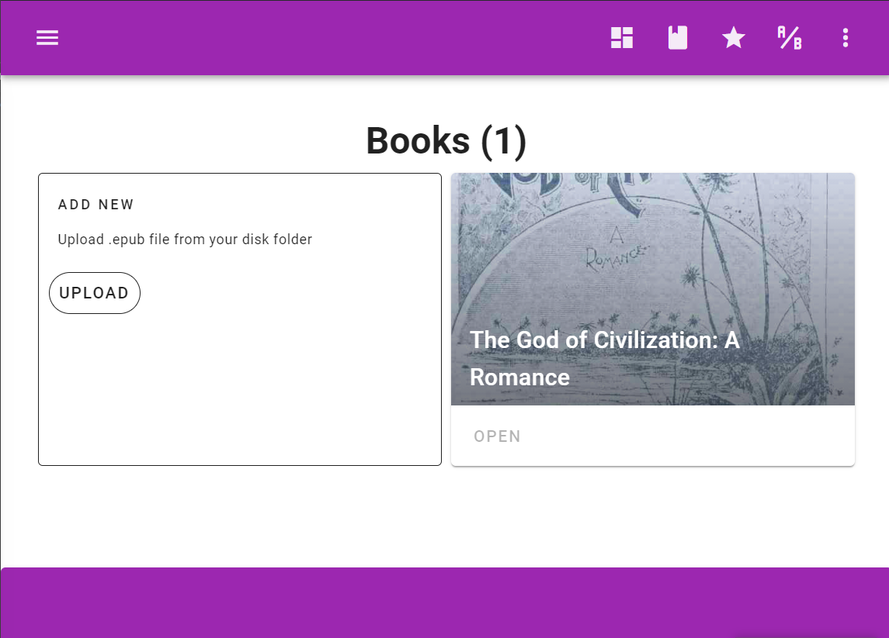
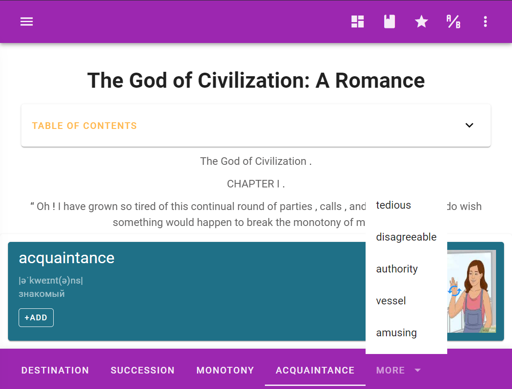
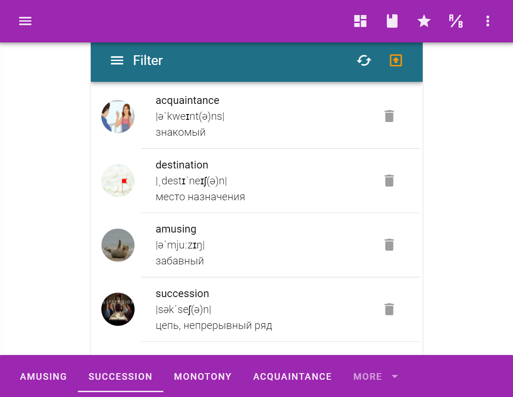
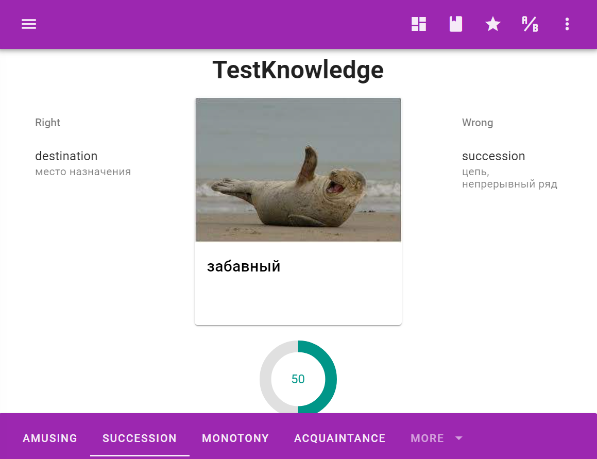

# english-learning-app
read books, learn new words

# How it works

Function            |  Screenshot
:-------------------------:|:-------------------------:
Choose a book (epub format) |  
Read. See the meaning of the words you don't know with just one click |  
Learn words |  
Test your knowledge |  

# Functions
- Load epub
- See the meaning of a word by clicking on it
- Add new word to a database
- Test your knowledge

# Tools
- JavaScript
- Electron
- SQLite
- Puppeteer
- Firebase
  - Use firebase as a common database for this app and a its [mobile version](https://github.com/pavelmarkov/ela-mobile-app)